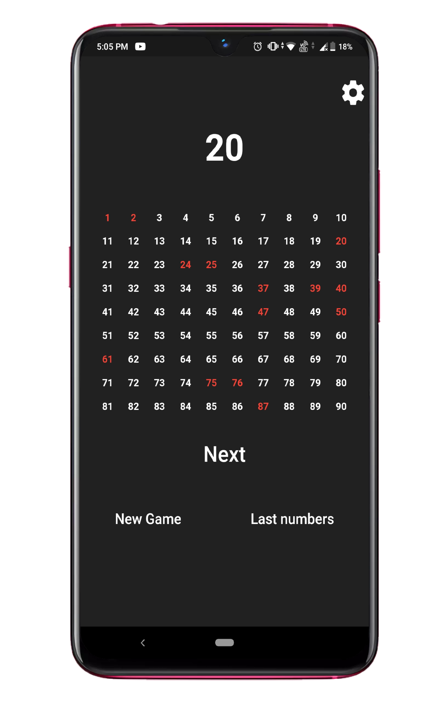

# tambola

A new Flutter project.

## Getting Started

A tambola game made in Flutter where you can fix some numbers so that you can win in real game it will not give the numbers you are fixing continuously but with some random difference so that no one can even think that you are cheating    

| 1 | 2|
|------|-------|
|||

| 3 | 4|
|------|-------|
|||

| 5 |6|
|------|-------|
|||

# Download
The app is avilable on Play Store
https://play.google.com/store/apps/details?id=tambola.hack
